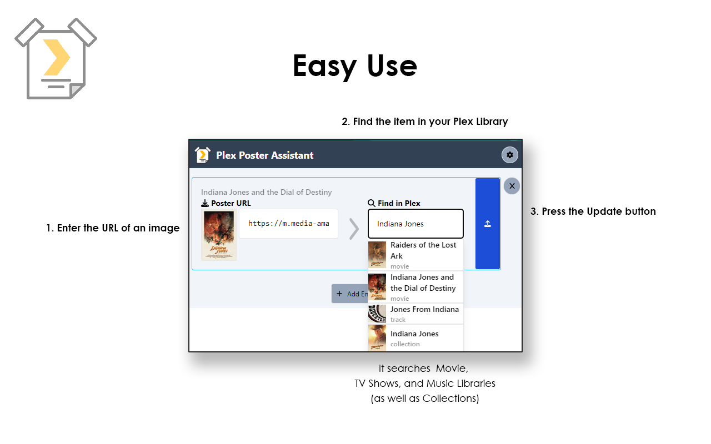

# Plex Poster Assistant
Plex Poster Assistant makes updating Plex poster art seamless from browser. It's designed to be deployed as a Chrome Extension, although it can also be run locally.

## Installation
This can be run locally can be installed using NPM or Yarn
```
yarn
```
### Local Development
The script can be run locally
```
yarn start
```

### Building
Building and packaging the project for use in the Chrome Store
```
yarn build
```
This will generate the production build of the project in the `/build/` directory. It will also build an archive ZIP file in `/archives/`

## Usage
Clicking the Chrome Extension button will display a window that will allow a user to enter an image URL. The user can then search through their Plex library to find the corresponding item, and then set the poster art.


### Necessary Data
#### Local Plex URL
You'll need to provide the local URL of your Plex server. This will include the protocol and the ports. Something like `http://192.168.0.1:32400`
#### Plex Token
You'll also need the Plex Token. Plex explains how you can retreive that [here](https://support.plex.tv/articles/204059436-finding-an-authentication-token-x-plex-token/)