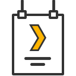

# Plex Poster Assistant
This is a project designed to make updating Plex poster art seamless from browser. It's designed to be deployed as a Chrome Extension, although it can also be run locally.

## Installation
This can be run locally can be installed using NPM or Yarn
```
yarn
```
## Local Development
The script can be run locally
```
yarn start
```

## Building
Building and packaging the project for use in the Chrome Store
```
yarn build
```
This will generate the production build of the project in the `/build/` directory. It will also build an archive ZIP file in `/archives/`

